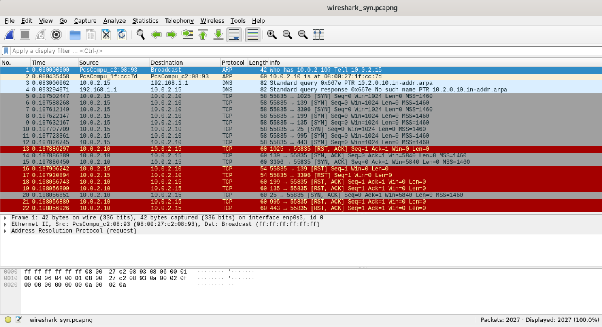
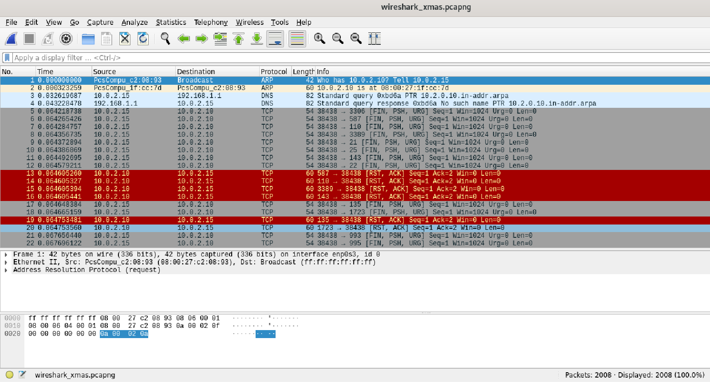
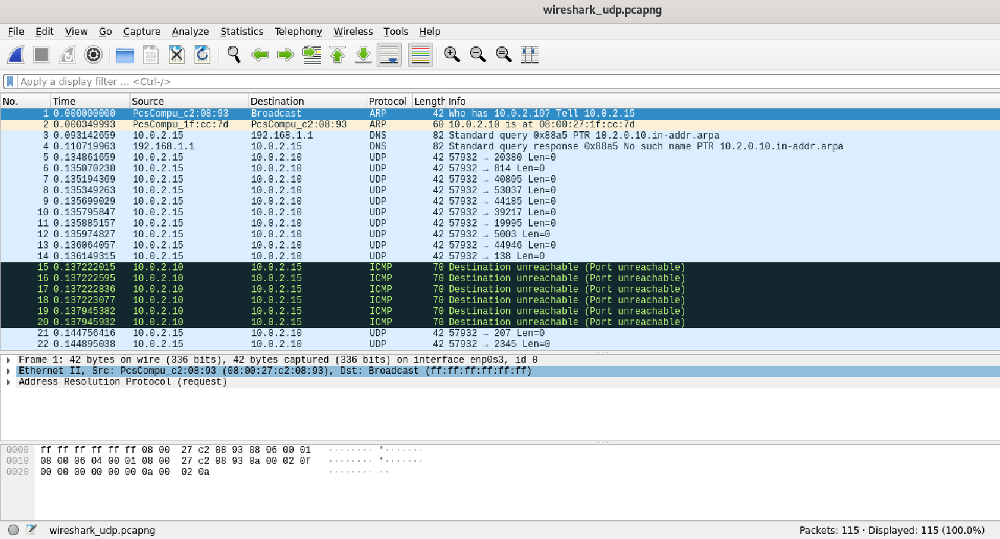

# 13-01_vulnerabilities
Уязвимости и атаки на информационные системы.
# Домашнее задание к занятию «Уязвимости и атаки на информационные системы»

### Задание 1

Скачайте и установите виртуальную машину Metasploitable: https://sourceforge.net/projects/metasploitable/.

Это типовая ОС для экспериментов в области информационной безопасности, с которой следует начать при анализе уязвимостей.

Просканируйте эту виртуальную машину, используя **nmap**.

Попробуйте найти уязвимости, которым подвержена эта виртуальная машина.

Сами уязвимости можно поискать на сайте https://www.exploit-db.com/.

Для этого нужно в поиске ввести название сетевой службы, обнаруженной на атакуемой машине, и выбрать подходящие по версии уязвимости.

Ответьте на следующие вопросы:

- Какие сетевые службы в ней разрешены?
- Какие уязвимости были вами обнаружены? (список со ссылками: достаточно трёх уязвимостей)
  
*Приведите ответ в свободной форме.*

**Ответ:**

- Скачаем ВМ **Metasploitable2 (Linux)** и подключим ее в **Virtual Box**:

<kbd></kbd>

- Просканируем ВМ с помощью утилиты **nmap**:
```
sudo nmap -sV 10.0.2.10
```
<kbd></kbd>

- В ВМ разрешены следующие службы:

  - ftp
  - ssh
  - telnet
  - smtp
  - domain
  - http
  - rpcbind
  - net-bios-ssn
  - exec
  - login
  - tcpwrapped
  - bindshell
  - nfs
  - mysql
  - postgresql
  - vnc
  - X11
  - irc
  - ajp13

- Примеры обнаруженных уязвимостей:

  - vsftpd 2.3.4 - Backdoor Command Execution
  - ISC BIND 9 - Denial of Service
  - WinVNC Web Server 3.3.3r7 - GET Overflow (Metasploit)
 
<kbd></kbd>

<kbd></kbd>

<kbd></kbd>

---

### Задание 2

Проведите сканирование Metasploitable в режимах SYN, FIN, Xmas, UDP.

Запишите сеансы сканирования в Wireshark.

Ответьте на следующие вопросы:

- Чем отличаются эти режимы сканирования с точки зрения сетевого трафика?
- Как отвечает сервер?

*Приведите ответ в свободной форме.*

**Ответ:**

- Проведем сканирование **nmap** в режиме **SYN**:
```
sudo nmap -sS 10.0.2.10
```
<kbd></kbd>

- Проведем сканирование **nmap** в режиме **FIN**:
```
sudo nmap -sA 10.0.2.10
```
<kbd></kbd>

- Проведем сканирование **nmap** в режиме **Xmas**:
```
sudo nmap -sX 10.0.2.10
```
<kbd></kbd>

- Проведем сканирование **nmap** в режиме **UDP**:
```
sudo nmap -sU 10.0.2.10
```
<kbd></kbd>


